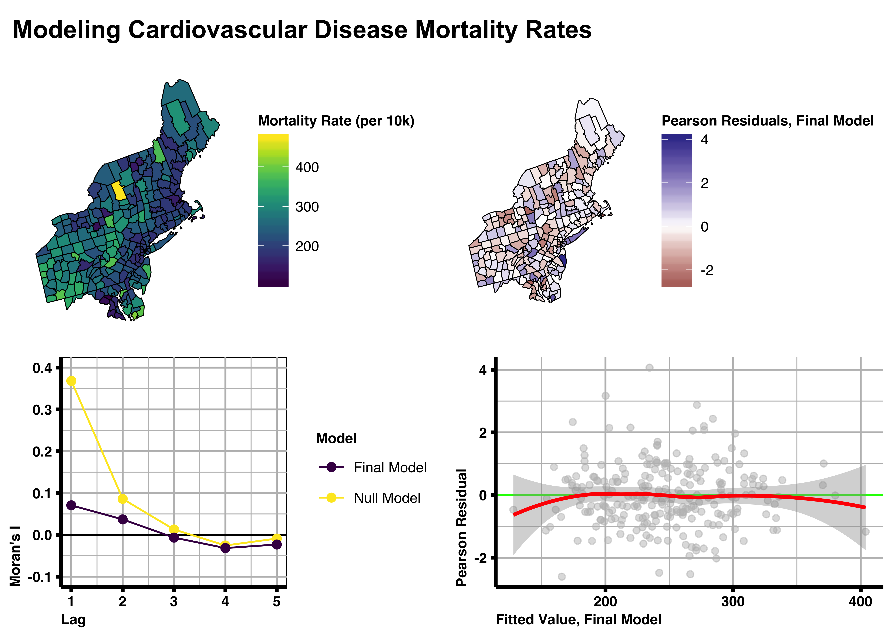

*fix population density*

```{r setup, include=FALSE}
knitr::opts_chunk$set(echo = TRUE)
```

```{r, echo=FALSE}
set.seed(9999)
```

```{r, echo=FALSE}
library(knitr)


```

# Motivation

## Background

Cardiovascular diseases are currently the leading cause of death in the United States. Much is already known about the causes of most cardiovascular diseases. We intend to explore potential environmental characteristics related to the mortality of cardiovascular diseases. 

## Analysis goal

We will attempt to identify county-level characteristics that are associated with county-level cardiovascular disease mortality rates in the Northeastern United States. In the process will we create three models and determine whether any of the models accounts for residual spatial autocorrelation that may be present.

## Learning objectives

The learning objectives include:

+ data wrangling
+ count data regression
+ spatial smoothing
+ modeling spatially dependent area-level data

## Libraries

The libraries used in this case study will be:

+ `ggplot2`, for creating beautiful visualizations

+ `cowplot`, for presenting multiple `ggplot2` visualizations 

+ `kableExtra`, for creating beautiful HTML tables

+ `MASS`, for conducting a negative binomial regression

+ `reshape2`, for simplifying correlation matrices

+ `tidyverse`, a collection of packages for data wrangling and summarization

+ `readxl`, for importing Excel data

+ `sf`, for wrangling and analyzing spatial data

+ `tmap`, for visualizing spatial data interactively

+ `spdep` for analyzing spatially dependent data

+ `car` for regression diagnostics

+ `cowplot`, for creating plots of plots

# What is the data?

We will be using data from two sources. 

We will be obtaining demographic and geographic information from the US Census Bureau, our first source of data.

Our analysis will use demographic information from the American Community Survey, which functions similarly to the US Census, but is conducted yearly. 

Two map files for this analysis will be considered. You can obtain these map files [here](https://www.census.gov/geographies/mapping-files/time-series/geo/carto-boundary-file.2017.html) and [here](https://www.census.gov/cgi-bin/geo/shapefiles/index.php). We will use the *2017 State, County, Minor Civil Division, and Incorporated Place FIPS Codes* provided [here](https://www.census.gov/geographies/reference-files/2017/demo/popest/2017-fips.html) to make identification of states and counties more practical in our analysis. 

Our second source of data is underlying cause of death data from CDC WONDER. Simply put, each death record contains separate sections for the underlying cause of death and all multiple causes of death. The CDC compiles information from these death records to create the respective datasets.

The way we define deaths in our analysis is important to consider. We will be defining deaths with a cardiovascular disease listed as the underlying cause of death as a death as a result of a cardiovascular disease.

Not all deaths have a single, direct cause. For that very reason, multiple causes of death are listed on death records. We've defined our cases in such a way to simplify our analysis and ensure that the cases we include in our study are the cases most likely to have died as a direct result from a cardiovascular disease. This is particularly important given the high prevalence of cardiovascular diseases.

The CDC's Wide-ranging ONline Data for Epidemiologic Research (WONDER) is a resource for a wide array of datasets surrounding the population health of the United States. There, you can find underlying cause of death data, which can be grouped by other characteristics such as sex, year, geographic region, and more. We will be examining diseases of the heart. These can be obtained using the following UCD-10 codes [here](https://wonder.cdc.gov/ucd-icd10.html):

+ I00-I09
+ I11
+ I13
+ I20-I51

# Data import

We start by loading the libraries we will need for this case study.

```{r}
library(MASS)
library(reshape2)
library(tidyverse)
library(readxl)
library(sf)
library(tmap)
library(viridis)
library(spdep)
library(car)
library(cowplot)
```

## Boundaries and reference Codes

We'll begin by importing the United States county boundaries data. Note that we are importing two different files. We must determine which of the two files to use. These two files have different resolutions.

The spatial data format we will be using for our analysis is known as the shapefile format. Shapefiles are a file format originated by Esri, the developers of the popular `ArcGIS`. Shapefiles can store a wide array of spatial data and are the most widely used format for spatial data. 

Using `read_sf` by the `sf` package, we can read in the shapefiles for our analysis. 

The shapefiles for this analysis can be found [here](https://www.census.gov/geographies/mapping-files/2017/geo/kml-cartographic-boundary-files.html).

Note that, upon importing the data, we use `st_transform()` to transform the data from one projection to another. This is normally done immediately following importation of the data as good practice. We often produce maps and calculate distances after importing the data; these can be severely impacted by the final projection of the data. We'll discuss again in more detail later in the case study.

```{r}
map_sf <- read_sf("cb_2017_us_county_20m/cb_2017_us_county_20m.shp")
st_crs(map_sf)
map_sf <- st_transform(map_sf, 2163)

map_sf_high_res <- read_sf("cb_2017_us_county_500k/cb_2017_us_county_500k.shp")
st_crs(map_sf)
map_sf_high_res <- st_transform(map_sf_high_res, 2163)
```

In addition to the shapefiles, we will import reference codes so that we can identify areas efficiently. We'll discuss in more detail later why having reference codes in datasets is helpful when dealing with spatial data. 

```{r}
FIPS_codes <- read_excel("all-geocodes-v2017.xlsx")
```

Let's compare the boundaries of each file. 

If we plot each, we can see that there is substantially more detail in the larger of the two shapefiles. This could be useful when generating maps that are smaller in scale or when the resolution could impact an analysis.

```{r, echo=FALSE, warning=FALSE}
NY_shape <- map_sf %>% filter(STATEFP=="36" | STATEFP=="34" | STATEFP =="42")
NY_shape_high_res <- map_sf_high_res %>% filter(STATEFP=="36" | STATEFP=="34" | STATEFP =="42")

#There are 58 counties in California. Since three are shown, a warning regarding the other 55 is shown. 

NY_subset <- ggplot() +
  geom_sf(data=NY_shape, color="blue", fill="transparent", size = 0.5) +
  geom_sf(data=NY_shape_high_res, color="red", fill="transparent", size = 0.5) +
  geom_sf_text(data=NY_shape_high_res, aes(label = NAME), size = 2.5) +
  xlim(2125000, 2175000) + 
  ylim(-150000, -100000) +
  xlab("Longitude") +
  ylab("Latitude")+
  theme_void()
```

With that said, if we zoom out enough the two shapefiles are almost indiscernable from one another.

```{r, echo=FALSE, warning=FALSE}
NY_NJ_PA <- ggplot() + 
  geom_sf(data=NY_shape, color="blue", fill="transparent", size = 0.1) +
  geom_sf(data=NY_shape_high_res, color="red", fill="transparent", size = 0.1) +
  xlim(1592058, 2303517) + 
  ylim(-391238.6, 344335) +
  theme_void()

arrowA <- data.frame(x1 = 28, x2 = 35, y1 = 23, y2 = 47)
arrowB <- data.frame(x1 = 28, x2 = 35, y1 = 18, y2 = 3)

ggplot() +
    coord_equal(xlim = c(0, 70), ylim = c(0, 50), expand = FALSE) +
    annotation_custom(ggplotGrob(NY_NJ_PA), xmin=0, xmax = 35, ymin = 0, 
        ymax = 50) +
    annotation_custom(ggplotGrob(NY_subset), xmin=35, xmax = 70, ymin = 0, 
        ymax = 50) +
  geom_segment(aes(x = x1, y = y1, xend = x2, yend = y2), data = arrowA, lineend = "round") +
  geom_segment(aes(x = x1, y = y1, xend = x2, yend = y2), data = arrowB, lineend = "round") +
  labs(title = "Impact of File Resolution on Shape Produced", subtitle = "Smaller shapefile in blue, larger shapefile in red") +
  theme_void()
```

We see that for certain applications the use of the larger shapefile is not only warranted, but necessary. Conversely, for other applications the use of the larger shapefile is not necessary.

Since we are not conducting an analysis that could introduce bias or cause misclassification as a result of the shapefilefile we use, we are free to use the smaller of the two shapefiles. The smaller shapefile requires less computational resources and produces almost identical maps at the state level and beyond, making it preferable for this analysis.

Often, analyzing data thoroughly can be severely hindered by the computational resources available. This is especially true when working with spatial data in `R`. Unless an analysis requires that those computational resources be used, it is often more efficient and effective to proceed with an analysis in a way that is less computationally-intensive.

Again, because our analysis is not dependent on the absolute precision of the maps we use, but rather the relative location of boundaries, we are able to use the smaller, lower-resolution file. If, for example, our analysis involved the aggregation of points inside a county, we would not have this luxury; the lower resolution would likely lead to points near the true boundary being misclassified as being within the borders of a nearby county. 

## ACS data

All of the data for this analysis can be found [here](https://www.census.gov/data.html) with their unique table code (listed below the names of the datasets below). Let's import the following datasets for 2017: 

---

MEDIAN AGE BY SEX

B01002

2013-2017 American Community Survey 5-Year Estimates

---

TOTAL POPULATION

B01003

2013-2017 American Community Survey 5-Year Estimates

---

RACE

B02001

2013-2017 American Community Survey 5-Year Estimates

---

HISPANIC OR LATINO ORIGIN BY RACE

B03002

2013-2017 American Community Survey 5-Year Estimates

---

MEDIAN INCOME IN THE PAST 12 MONTHS (IN 2017 INFLATION-ADJUSTED DOLLARS)

S1903

2013-2017 American Community Survey 5-Year Estimates

---

SELECTED CHARACTERISTICS OF HEALTH INSURANCE COVERAGE IN THE UNITED STATES

S2701

2013-2017 American Community Survey 5-Year Estimates

---

These datasets will help us produce many of the covariates in the models we create. 

```{r}
med_age <- read_csv("ACS_17_5YR_B01002/ACS_17_5YR_B01002_with_ann.csv")

total_pop <- read_csv("ACS_17_5YR_B01003/ACS_17_5YR_B01003_with_ann.csv")

race <- read_csv("ACS_17_5YR_B02001/ACS_17_5YR_B02001_with_ann.csv")

ethnicity <- read_csv("ACS_17_5YR_B03002/ACS_17_5YR_B03002_with_ann.csv")

med_inc <- read_csv("ACS_17_5YR_S1903/ACS_17_5YR_S1903_with_ann.csv")

perc_insured <- read_csv("ACS_17_5YR_S2701/ACS_17_5YR_S2701_with_ann.csv")
```

## Underlying cause of death data

Let's import the underlying cause of death data. 

This dataset will provide data for the counts for our count regression models.

```{r}
ucd_heart <- read_tsv("ucd_cardiovascular_diseases_county_2017.txt",
                      na = c("Suppressed","Unreliable", "Missing"))
glimpse(ucd_heart)
```

Now that we've imported the data from both of our data sources, we can wrangle the data for our analysis needs. 

# Data wrangling

## ACS data

### Codebook

We'll begin by wrangling the American Community Survey data. Each dataframe we've downloaded will first be prepared. We will join the prepared dataframes to the analysis dataframe only after each of our dataframes has been prepared.

American Community Survey data is extremely well-maintained. The data has a large amount of supporting documentation. As good practice we will consult the supporting documentation. 

We will be using the tableshells for the survey, codebooks of sorts, to help us wrangle the data for this analysis. The table shells documents contain approximate names and line numbers of the variables used to produce tables produced from information gathered by the American Community Survey. [The document can be found here for download.](https://www2.census.gov/programs-surveys/acs/tech_docs/table_shells/2017/?#)

We'll import the table shell for each dataset we imported. Since

```{r}
B01003 <- read_xlsx("B01003.xlsx")
B01002 <- read_xlsx("B01002.xlsx")
B02001 <- read_xlsx("B02001.xlsx")
B03002 <- read_xlsx("B03002.xlsx")
S1903 <- read_xlsx("S1903.xlsx")
S2701 <- read_xlsx("S2701.xlsx")

colnames(B01003)
colnames(B01002)
colnames(B02001)
colnames(B03002)
colnames(S1903)
colnames(S2701)
```

We only need two columns from each table shell, the line number and the description for that line number. These correspond to the approximate column number and the variable name for each dataset.

We'll extract the line number and description from each and add a third column that will help us identify the dataset to which the line number and description correspond to. 

Note that we use `dplyr::select()` rather than `select()` alone. This is because another package we've loaded also has a function called `select()`. We make our choice of function more explicity by calling `dplyr::select()`.

```{r}
B01002 <- B01002 %>%
  rename(Line_Number=`Line Number`) %>%
  dplyr::select(Line_Number, Description) %>%
  mutate(Type="med_age")

B01003 <- B01003 %>%
  rename(Line_Number=`Line Number`) %>%
  dplyr::select(Line_Number, Description) %>%
  mutate(Type="total_pop")

B02001 <- B02001 %>%
  rename(Line_Number=`Line Number`) %>%
  dplyr::select(Line_Number, Description) %>%
  mutate(Type="race")

B03002 <- B03002 %>%
  rename(Line_Number=`Line Number`) %>%
  dplyr::select(Line_Number, Description) %>%
  mutate(Type="ethnicity")

S1903 <- S1903 %>%
  rename(Line_Number=`Line Number`) %>%
  dplyr::select(Line_Number, Description) %>%
  mutate(Type="med_inc")

S2701 <- S2701 %>%
  rename(Line_Number=`Line Number`) %>%
  dplyr::select(Line_Number, Description) %>%
  mutate(Type="perc_insured")

codebook <- rbind(B01002,
  B01003,
                  B02001,
                  B03002,
                  S1903,
                  S2701)

dim(codebook)
```

If we look at our codebook, we'll find that the line numbers lacking whole numbers are of no use to us. There are no "half" lines in a dataframe. These line numbers that are not whole numbers refer to subheadings.

```{r}
head(codebook)
```

We can remove this using a the `%%` operator, which can help us identify whether there is remained following division. If we divide by `1` and have a non-zero number, the number is a not a whole number. Using this test, we remove the rows representing subheadings from our codebook.

```{r}
codebook <- codebook %>% 
  filter(Line_Number %% 1 ==0)
```
Our codebook is still mainly in the form of a tibble. This prevents us from seeing most/all the output at once, much like the `head()` and `glimpse()` functions. We can see most/all of the output at once if we coerce our codebook to a `dataframe` class.

```{r}
class(codebook)

codebook <- data.frame(codebook)

class(codebook)
```

Our codebook is now ready to use. 

```{r}
head(codebook)
```

We can use this codebook throughout our analysis to help find the variables we are looking for.

Keep in mind that a codebook like this—and the table shells we used to produce it—sometimes does not cover the full range of variables or their exact corresponding names/line numbers. A codebook is a guide. During the downloading process tables can be reshaped to include additional information and this may alter the line numbers and variable names.  

This is exactly the case with the datasets we downloaded. Upon downloading a dataframe with information for US counties, several additional columns were added to each dataset. These columns include a column with important spatial reference codes which we'll use later to link data to areas on a map

As with all survey data, there is uncertainty in the estimates produced. The American Community Survey includes point estimates and margins of error for each point estimate in each of the tables they make publicly available. In addition to the point estimates, margins of error are included in the datasets we downloaded. 

Despite these limitations, we have created a document with a standardized list of variable names. Although these variable names may possibly deviate in the datasets, they are extremely helpful at making known what is available in the dataset and what should be looked for. 

We will consult our codebook throughout the wrangling process. 

### Median age

Let's wrangle our dataset representing the median age of each county. 

We'll consult our codebook first. We need to identify which specific variable we'll be using in our model.

Usually, this will be determined in advance of an analysis with the help of a codebook. For demonstrative purposes, we will consult the codebook as we wrangle our data.

From the output below, we can conclude that the available columns are separated by sex and total. In our imported data this may not be the case. However, after consulting the codebook we now have an idea as to how the imported dataframe may be structured

```{r}
codebook %>%
  filter(Type=="med_age")
```

As we can see, our imported dataframe has more than the 3 variables listed in our codebook. Remember, the American Community survey includes margins of error along with the estimates they provide in tables. This partly explains why there are more columns than indicated by our codebook.

```{r}
dim(med_age)
```

Let's look inside the dataframe. 

Because of the number of columns this dataframe has (`r dim(med_age)[2]`), it'd be better examined with `glimpse()`. 

```{r}
glimpse(med_age)
```

A few things can be said about the dataframe from the above output. 

The column names of this dataset correspond to a codebook and are difficult to interpret on their own. The first row of the dataframe uses more interpretable column names. In addition to this, not all the columns have information we need for our analysis.

We need to obtain practical column names and keep the information we need, mainly the county and corresponding estimates. 

We do just that below.

We substitute the column names with information from the first row, again consulting our codebook along the way to help identify the information we need. 

```{r}
colnames(med_age)
colnames(med_age) <- med_age[1,]
codebook %>%
  filter(Type=="med_age")
colnames(med_age)
```

It looks like the total estimate for median age is listed as `Estimate; Median age -- - Total:`. Again, sometimes codebooks deviate slightly from the tables produced during the downloading process. Now that we have identified the information we need, we can proceed with wrangling this dataframe for our use. 

What is now our first row has already been used to create columns names and is therefore no longer of use to use. We delete the first row

```{r}
med_age <- med_age[-1,]
med_age[1,]
```

If we look at our dataframe now, each population estimate is coupled to a five digit code. Each US county has a unique identifier, called a FIPS code, that allows tabular data to be joined to spatial data. For now, that identification code is referred to as `Id2`.

```{r}
head(med_age)
```

Eventually, we will be joining this dataframe to our spatial data. Rather than join our tabular data based upon the name of each county, we will use this five digit code to join our tabular data to our spatial data. This avoids having to use regular expressions to make the names of counties parsimonious before joining, making such joins both more efficient and **accurate**. 

*MICHAEL:LEAH* In the blurb above, I'm not sure if **accurate** is appropriate. Is there a word commonly used in data science that describes correctly attributing information to an observation/row. In much of the spatial work I've done, such joins are incredibly important. I think it'd be extremely beneficial here if we could highlight the importance of reference codes using data science language.

For wrangling and regression analysis purposes, we need to rename our columns with information gathered in the process above. Our other dataframes, also from the American Community Survey, should also use unique FIPS codes to refer to counties. Let's keep this process in mind. 

Below, we rename the columns and get rid of information we don't need.

```{r}
med_age <- med_age %>%
  rename("FIPS"=Id2, "median_age"=`Estimate; Median age -- - Total:`) %>%
  dplyr::select(FIPS, median_age)
```

Our variable of interest, median age of the county, needs to be `numeric`. Let's check this before moving on.
```{r}
class(med_age$median_age)
med_age$median_age <- as.numeric(med_age$median_age)
```

The dataframe is now ready to be inserted into our analysis dataframe. 

```{r}
head(med_age)
```

### Total population

Let's prepare the dataset with the total population for each county. 

We consult the codebook again to get an idea of how this dataset might be structured.

```{r}
codebook %>%
  filter(Type=="total_pop")
```

Given what we've learned from wrangling the previous ACS dataset, it's likely that this dataframe also contains a margin of error for each estimate.

This dataset has `r dim(total_pop)[2]` columns and `r dim(total_pop)[1]` rows. Given the small number of columns, it's more expedient to use the `head()` function to first visualize the dataframe. We could also use `glimpse()`; aside from the very small practical advantage `glimpse()` gives us in this scenario, we use `glimpse()` for largely demonstrative purposes.

```{r}
dim(total_pop)

head(total_pop)
```

Like the prior dataset, this dataset uses column names that are difficult to interpret. If we look closely, it appears that the first observation of each column—that is,the first row—again contains more practical names. Our wrangling approach is therefore pretty similar to the last dataset.

We substitute the existing column names with more interpretable column names, deleting the row of the dataframe we used in that process.

```{r}
colnames(total_pop) <- total_pop[1,]
total_pop <- total_pop[-1,]
```

We rename the columns we'll need and get rid of the coluns we don't need. 

```{r}
total_pop <- total_pop %>%
  rename("FIPS"=Id2, "Population"=`Estimate; Total`) %>%
  dplyr::select(FIPS, Population)
```

Lastly, we'll confirm that our variable of interest is `numeric` and in the units we want, 100,000 person-units.

```{r}
class(total_pop$Population)

total_pop$Population_100k <- as.numeric(total_pop$Population)/1e+05
```

The dataframe is now ready to be inserted into our analysis dataframe. 

```{r}
head(total_pop)
```

### Wrangling function

By now, its apparent that each of the remaining datasets will require similar steps to wrangle. We should begin to think about creating a function that will help streamline the wrangling process.

If we had to wrangle many similarly sourced datasets, this could make the wrangling process much more efficient and could save hours of work that could be spent directly analyzing the data. If done properly, such a function could actually prevent human error that commonly emerges with tasks that require repitition.

We can take advantage of the standardization of the datasets to create a function that would expedite the wrangling process. This, of course, assumes that the wrangling process for the remaining datasets is the same as the wrangling process of the first two datasets we wrangled. 

Below we create a function that wrangles the ACS datasets from the pattern we recognized while wrangling the first two datasets.

In addition to the object with the data we are wrangling, the function requires and existing column name and the desired column name of the variable of interest from the dataset. 

*The function below make look slightly odd—we rename the same variable twice; this is because the `tidyverse` has verbs that use non-standard evaluation, meaning that some of the standard conventions in R programming are not adhered to perfectly. Non-standard evaluation can complicate the relationship between the input and output produced by custom functions. Non-standard evaluation prevents us from renaming our variable with our intended expression, instead renaming our variable to the name found in the function's environment. In short, we use `base` to rename an inprecisely renamed variable. We created the function below for ease of comprehension. Still, there are more advanced, nuanced approaches to deal with this problem that can be found on [this page](https://dplyr.tidyverse.org/articles/programming.html).*

```{r}
ACS_wranglr <- function(dataframe, old_name, new_name){
  colnames(dataframe) <- dataframe[1,]
  dataframe <- dataframe[-1,]
  colnames(dataframe)[colnames(dataframe)=="Id2"] <- "FIPS"
  dataframe <- dataframe %>%
    rename(new_name=paste0(old_name))
  dataframe <- dataframe %>%
    dplyr::select(FIPS, new_name)
  colnames(dataframe)[colnames(dataframe)=="new_name"] <- paste0(new_name)
  dataframe
}
```

### Race 

Let's prepare the dataset with the race composition for each county. 

We consult the codebook again to get an idea of how this dataset might be structured. For the purposes of this analysis, we are interested in obtaining information on the number of people estimated to identify as White, Black or African American, or Asian alone. Our codebook suggests these variables should be present in the dataframe we imported.

```{r}
codebook %>%
  filter(Type=="race")
```

If the pattern continues, this dataframe should have more than 20 columns

```{r}
dim(race)
```

The dataset has `r dim(race)[2]` columns.

Using `glimpse()`, it becomes apparent that this dataset also uses impractical column names which could be made more practical with replacement by names included in the first row. 

```{r}
glimpse(race)
```

Let's use our function to wrangle this dataset. 

Our function can only simplify the process one variable at a time. This prevents us from wrangling all the variables pertaining to race at the same time.

We can revise our function to accomodate more variables. However, We are interested in only a handful of variables. There is therefore no need to revise our function, as the function we created can already do what we need with minimal work. 

Still, we will need to produce a dataframe for each race we are considering using as a covariate. Since we are ultimately interested in producing a percentage to represent the racial composition of a county, we will also need a dataframe with information about the total population of each county. These dataframes can then be joined to one another, manipulated, and then joined to our analysis dataframe.

With the column names we've gathered from the glimpse function...

```{r}
glimpse(race)
```

...we can begin to produce the dataframes we need. 

```{r}
race_total <- ACS_wranglr(race, "Estimate; Total:", "Total")
race_W <- ACS_wranglr(race, "Estimate; Total: - White alone", "W_only")
race_BA <- ACS_wranglr(race, "Estimate; Total: - Black or African American alone","BA_only")
race_A<- ACS_wranglr(race, "Estimate; Total: - Asian alone", "A_only")
```

We then join them to one another and manipulate them to produce the percentages for our analysis.

```{r}
race <- race_total %>%
  left_join(race_W, by="FIPS") %>%
  left_join(race_BA, by="FIPS") %>%
  left_join(race_A, by="FIPS")

sapply(race, class)

race <- race %>%
  mutate(Total=as.numeric(Total),
         W_only=as.numeric(W_only),
         BA_only=as.numeric(BA_only),
         A_only=as.numeric(A_only)) %>%
  mutate(Perc_W_only=W_only *100/Total,
         Perc_BA_only=BA_only*100/Total,
         Perc_A_only=A_only*100/Total) %>%
  dplyr::select(FIPS,
                Perc_W_only,
                Perc_BA_only,
                Perc_A_only)
```

### Ethnicity

We can prepare the dataset with the ethnic composition of each county in much the same way.

```{r}
ethnicity_total <- ACS_wranglr(ethnicity, "Estimate; Total:", "Total")
ethnicity_Hispanic_Latino <- ACS_wranglr(ethnicity, "Estimate; Hispanic or Latino:", "Hispanic_Latino")

ethnicity <- ethnicity_total %>%
  left_join(ethnicity_Hispanic_Latino, by="FIPS")

sapply(ethnicity, class)

ethnicity <- ethnicity %>%
  mutate(Total=as.numeric(Total),
         Hispanic_Latino=as.numeric(Hispanic_Latino)) %>%
  mutate(Perc_Hispanic_Latino=Hispanic_Latino*100/Total) %>%
  dplyr::select(FIPS, Perc_Hispanic_Latino)
```

### Median income

The next couple of datasets require a slightly different approach.

Let's consult our codebook.

```{r}
codebook %>%
  filter(Type=="med_inc")
```

As we can see from the output below, there are many columns in this dataset.

```{r}
dim(med_inc)
```

We can take a look at the first few column names without the tibble output using the `t()` function in conjunction with the `dataframe()` function. Our column is likely one of the first given its breadth and its relative position shown by the codebook. 

**Were this not the case, we would have to choose between one of two options to identify the columns for this analaysis:**

1. **Use regular expressions to sift through the column names**
2. **Find a resource, if available, that could help produce a codebook more useful than the one we are currently using.**

```{r}
t(data.frame(med_inc[1,1:10]))
```

Having identified the column we need, we can proceed to use the function we made to wrangle the dataset. 

```{r}
med_inc <- ACS_wranglr(med_inc,"Median income (dollars); Estimate; Households", "median_income")
```

We then rescale the variable. Our variabl is now in $10,000-units.

```{r}
sapply(med_inc, class)

med_inc$median_income <- as.numeric(med_inc$median_income)/1e+04
```

### Percent insured

The last dataset we wrangle by the American Community Survey follows a similar process. 

```{r}
codebook %>%
  filter(Type=="perc_insured")
```

Again our column is likely one of the first given its breadth and its relative position shown by the codebook.

```{r}
t(data.frame(perc_insured[1,1:10]))
```

Again, having identified the column we need, we can proceed to use the function we made to wrangle the dataset. 

```{r}
perc_insured <- ACS_wranglr(perc_insured,"Percent Insured; Estimate; Civilian noninstitutionalized population", "perc_insured")

sapply(perc_insured, class)

perc_insured$perc_insured <- as.numeric(perc_insured$perc_insured)
```

## Underlying cause of death data

Let's wrangle the mortality data. We are no longer wrangling American Community Survey data and thus have no use for the `ACS_wranglr()` function we made.

```{r}
dim(ucd_heart)

glimpse(ucd_heart)
```

The crude rate included in the mortality data is calculated by dividing the number of deaths by a population that differs from that of the actual population of each county. For crude rates, the Centers for Disease Control exludes certain members of the population. We will be including all members of the population as an offset in our regression analysis using data from the American Community Survey, meaning we can get rid of the population estimates and crude rates provided in the dataset as well as other information that we do not want joined to our analysis dataframe. 

```{r}
ucd_heart$Notes <- NULL
ucd_heart$Population <- NULL
ucd_heart$`Crude Rate` <- NULL
ucd_heart$`2013 Urbanization Code` <- NULL
```

We then coerce the urbanization categories to a `factor` class. 

```{r}
class(ucd_heart$`2013 Urbanization`)
ucd_heart$`2013 Urbanization` <- as.factor(ucd_heart$`2013 Urbanization`)
glimpse(ucd_heart)
```

We rename the five digit reference codes and order the urbanization categories. 
```{r}
ucd_heart <- ucd_heart %>%
  rename("FIPS"=`County Code`)

levels(ucd_heart$`2013 Urbanization`)
ucd_heart$`2013 Urbanization` <- factor(ucd_heart$`2013 Urbanization`,
       levels = c("NonCore (Nonmetro)",
                  "Micropolitan (Nonmetro)",
                  "Small Metro",
                  "Medium Metro",
                  "Large Fringe Metro",
                  "Large Central Metro"))

levels(ucd_heart$`2013 Urbanization`)
```

We then collapse the categories we created. This will allow us visualize the categories in another way should the original categories be too noisy. 

```{r}
ucd_heart <- ucd_heart %>% mutate("2013 Urbanization Simplified"=fct_collapse(`2013 Urbanization`,
               `Large Metro`=c("Large Fringe Metro",
                  "Large Central Metro"),
               `Small/Medium Metro`=c("Small Metro",
                  "Medium Metro"),
               `Nonmetro`=c("NonCore (Nonmetro)",
                  "Micropolitan (Nonmetro)")))
```

We check for any missing observations. 

```{r}
apply(ucd_heart, 2, function(x)sum(is.na(x)))
```

It appears that there may be 78 rows with missing information. After confirming this, we discard these rows.

```{r}
ucd_heart %>%
  filter(is.na(Deaths) & is.na(FIPS))

ucd_heart <- ucd_heart %>%
  filter(!(is.na(Deaths) & is.na(FIPS)))
```

Recall that we transformed the spatial data as soon as the data was imported. This is considered good practice. Depending on the projection of the spatial data, not doing so could have unintended consequences on the analysis.

We transformed the spatial data to the *US National Atlas Equal Area* projection. This projection does a good job of representing the size of states. Some projections, such as the popular Mercator projection, make areas near the north and south poles appear disproportionately larger than areas further away. In the Mercator projection, Greenland is about the same size as Africa, when the latter is in fact larger the former. 

We use the `st_crs` function to determine the projection (coordinate reference system) used by the United States county boundaries imported. We set the projection immediately after importing the boundaries to the *US National Atlas Equal Area* projection, identifiable by an EPSG of 2163.

EPSG codes are essentially identification codes for projections. Again, the *US National Atlas Equal Area* projection is identifiable by an EPSG of 2163. Were we interested in conducting an analysis using a different projection, we would refer to a different EPSG code to transform our spatial data. EPSG codes for different regions of the world can be found on [this registry](http://www.epsg-registry.org/). 

If we check the projectinon of our spatial data, we find that the resulting EPSG code matches the EPSG code we used to transform the spatial data. 

```{r}
st_crs(map_sf)
```

Our spatial data represents a large portion of the United States. We need this spatial data to produce spatially defined covariates and create diagnostic plots later in our analysis. For this reason, we will be appending this object with information from the datasets we prepared earlier.

```{r}
dim(map_sf)

glimpse(map_sf)
```

We first join the mortality data to this object,first renaming the column with reference codes for each county to match the column name of our prepared datasets.

```{r}
map_sf <- map_sf %>%
  rename("FIPS"=GEOID) %>%
  left_join(ucd_heart, by="FIPS")

class(map_sf$Deaths)
class(map_sf$`2013 Urbanization`)
```

## State and county names

Reference codes alone are not very useful for analytical purposes. We need to join our reference data to distinguish between observations by name.

Information from our reference dataset, however, is not yet ready to be joined to analysis dataframe.

We remove much of the whitespace in between cells.

```{r}
glimpse(FIPS_codes)

head(FIPS_codes)

colnames(FIPS_codes)
FIPS_codes[4,1:6]
colnames(FIPS_codes) <- FIPS_codes[4,]
FIPS_codes <- FIPS_codes[-(1:4),]
```

Our data appears to contain codes that refer to regions at varying levels of the US. Additionally, the dataset does not contiain five-digit reference codes that we can use. The reference codes we have been using contain a two-digit state code followed by a three-digit county code.

```{r}
glimpse(FIPS_codes)
```

We need to combine the state and county codes in our reference dataset. Our reference dataset, however, has separate rows for national, sub-regional,  state, county, and even town-level information. Fortunately, our reference dataset contains summary levels that allow us to differentiate between these levels. 

```{r}
FIPS_codes <- sapply(FIPS_codes[,1:length(colnames(FIPS_codes))], as.factor)

class(FIPS_codes)

FIPS_codes <- as.data.frame(FIPS_codes)

sapply(FIPS_codes[,1:(length(colnames(FIPS_codes))-1)], summary)
```

We can try to combine our state and county codes as is. However, given that other other regional information is contained in this dataset, doing so would create a subset of 5-digit codes that don't refer to an actual county. The FIPS codes we are using are a combination of a non-zero state and county codes. Our current dataset uses repeated zeros to denote that no such code exists at that area-level. 

We can eliminate rows that have non-zero state and county codes. Although not a bad idea, this would involve extensive use of regular expressions.

Instead, we can take advantage of the fact that there is a column that allows us to distinguish between the different area-levels. We can create a list of multiple dataframes, one per area-level, using the `group_split()` function by the `dplyr` package in the `tidyverse`. By separating our reference dataset in this way, we can use a subset of the data that refers to actual counties to create the five-digit reference codes we need. 

Let's take a final look at our reference dataset.

```{r}
colnames(FIPS_codes)

class(FIPS_codes)
```

We need the summary level for our plan with the `group_split()` function to work properly. We also need our state and county codes; these will be combined to create the five-digit FIPS code we need. Most importantly, we need the name of the county.

We select the columns we need and rename them for ease of use. To combine state and county codes, we coerce the columns of our reference dataset to character class with the `sapply()` function. The `sapply()` function produces a matrix, however, `dplyr` verbs cannot be applied to a matrix. We coerce the reference dataset back to a `dataframe` class and then combine the state and county codes. We then split our reference dataset by area-level with the `group_split()` function.

```{r}
FIPS_codes <- FIPS_codes %>%
  dplyr::select(`Summary Level`,
         `State Code (FIPS)`,
         `County Code (FIPS)`,
         `Area Name (including legal/statistical area description)`) %>%
  rename("summary_level"=`Summary Level`,
         "state_code"=`State Code (FIPS)`,
         "county_code"=`County Code (FIPS)`,
         "area_name"=`Area Name (including legal/statistical area description)`) %>%
  sapply(as.character) %>%
  data.frame() %>%
  mutate("FIPS"=paste0(state_code,county_code))

FIPS_codes_dfs <- FIPS_codes %>%
  group_split(summary_level)
```

The `group_split()` function returns a list. If we take a quick glance at this list, it becomes apparent that one of the groups contains a state name and another group contains a county name—knowing each for a given reference code in our analysis dataframe would be extremely useful.

```{r}
class(FIPS_codes_dfs)

FIPS_codes_dfs %>%
  lapply(`[`, 1, )
```

We save each of these groups to an object.

```{r}
state_codes <- FIPS_codes_dfs[[2]]
glimpse(state_codes)
state_codes <- state_codes %>%
  dplyr::select(state_code, area_name) %>%
  rename("state_name"=area_name)
glimpse(state_codes)
county_codes <- FIPS_codes_dfs[[3]]
glimpse(county_codes)
county_codes <- county_codes %>%
  dplyr::select(-summary_level) %>%
  rename("county_name"=area_name)
glimpse(county_codes)
```

Each of the above two objects contains a column with a state code. We use the state codes to join the state name information to the object with our county name information. We then use the FIPS codes we produced to join the ACS datasets we prepared earlier to the object with our county name information. The resulting object contains the ACS survey data we wrangled along with state and county names by unique five-digit FIPS code. 

```{r}
covariates <- county_codes %>%
  left_join(state_codes, by="state_code") %>%
  left_join(total_pop, by="FIPS") %>%
  left_join(med_age, by="FIPS") %>%
  left_join(race, by="FIPS") %>%
  left_join(ethnicity, by="FIPS") %>%
  left_join(med_inc, by="FIPS") %>%
  left_join(perc_insured, by="FIPS")

colnames(covariates)
```

We can also use information from the US Census Bureau to identify which codes correspond to the states of interest [click. here](https://www.census.gov/geographies/reference-files/2017/demo/popest/2017-fips.html)).

For demonstrative purposes, we will exclude Alaska, Hawaii, and Puerto Rico.

```{r}
map_sf <- map_sf %>%
  left_join(covariates, by="FIPS")

contiguous_us <- map_sf %>% filter(!(state_name %in% c("Alaska",
                                                    "Hawaii",
                                                    "Puerto Rico"
                                                    )))
```

## Reference code errors

When using reference codes to join datasets, it's important to check for missing values. If the datasets use the same reference code system—but were updated at different times or use a slightly different convention—some observations will be unable to join correctly. This could cause issues that are difficult to diagnose later on. As always, it's important to check your work, especially early on during the wrangling process.

[The CDC has published a document with changes to county geographies ](https://www.cdc.gov/nchs/nvss/bridged_race/county_geography-_changes2015.pdf). If we open this document, we learn that some counties are referred to by names other than those listed in mortality files. 

Let's examine our dataset to see if this is an issue. 

We can do this by examining the number of missing values for a given column. This is because errors in joins often manifest themselves as missing values. 

Using the `apply()` function, we can count the number of missing values per column. It appears that there are two types of missing values: missing values caused by suppressed death counts and missing values pertaining to county names and/or urbanization categories. 

```{r}
apply(contiguous_us, 2, function(x)sum(is.na(x)))
```

If we look at the missing data more closely we find that the missing values pertaining to county names and/or urbanization categories is entirely attributable to one county. This county is listed as having had a change in name on the document published by the CDC referred to previously.

```{r}
contiguous_us %>%
  filter(is.na(County)|
           is.na(`2013 Urbanization`)) %>% 
  pull(NAME)
```

```{r, echo = FALSE, out.width = "100%", out.height="500%"}
knitr::include_graphics("county_geography-_changes2015.pdf")
```

Furthermore, this observation has an observed population but missing death count and crude mortality rate. 

```{r}
contiguous_us %>%
  filter(is.na(County)|
           is.na(`2013 Urbanization`)) %>% 
  pull(Population_100k)

contiguous_us %>%
  filter(is.na(County)|
           is.na(`2013 Urbanization`)) %>% 
  pull(Deaths)
```

Assuming that an overwhelming majority of missing mortality data is a result of data suppression, we can determine that there was a single error that occurred when joining datasets by reference codes given the above information. Additionally, because population data is properly joined and mortality data is missing we can deduce that this single error emerged when the mortality data was joined.

If we look at the mortality data we find that what is now Oglala Lakota County (46201) is referred to as Shannon County (46113). This is confirmed in the document embedded above.

```{r}
ucd_heart %>%
  filter(FIPS==46113|FIPS==46102)
```

To fix the error, we need to treat Oglala Lakota County (46102) as if it were Shannon County (46113) in what will become our analysis dataframe. 

To do this we overwrite data from Oglala Lakota County (46102) with data from Shannon County (46113). We create a dataframe with the data that we want to use to replace missing values. Then we use `left_join()` to merge this dataframe to what will become our analysis dataframe. This causes two additional columns to be made, each with the same name as the original column and with an `.x` or `.y` at the end. This occurs when joins are done with datasets that have similarly named columns.  We then use the `coalesce()` function to merge the two colums that were created during this join into one column. Lastly, we use the `select()` function in conjuction with the `names` function to ensure that we obtain a dataset with the same columns we started with.

```{r}
oglala_correction <- ucd_heart %>%
  filter(FIPS=="46113") %>%
  mutate(FIPS="46102", County="Oglala Lakota")

contiguous_us <- contiguous_us %>%
  left_join(oglala_correction, by="FIPS") %>%
  mutate(Deaths=coalesce(Deaths.x, Deaths.y)) %>%
  mutate(County=coalesce(`County.x`,`County.y`)) %>%
  mutate(`2013 Urbanization`=coalesce(`2013 Urbanization.x`,`2013 Urbanization.y`)) %>%
  mutate(`2013 Urbanization Simplified`=coalesce(`2013 Urbanization Simplified.x`,`2013 Urbanization Simplified.y`)) %>%
  select(names(contiguous_us))
```

Now that we have the death count and population of each county correctly joined, we can calculate the crude rate per 100,000 people.

```{r}
contiguous_us <- contiguous_us %>%
  mutate("Crude Rate"=round((Deaths/Population_100k),3))  %>%
  mutate("Crude Rate"=round((Deaths/Population_100k),3))
```

## Spatial lags and smoothing

We can create covariates and visualizations using data from the relative positions given by the spatial data. Doing so will require that we create a neighborhood matrix that defines those relative positions. 

We save our spatial data to an object with a different name. 

```{r}
us_cvd_sp_data <- contiguous_us
```

To visualize the neighborhood matrix, we need to create: a spatial polygons dataframe from our spatial data, a neighborhood list from the spatial polygons dataframe, an sf object of the spatial weights from the neighborhood list, and lastly an sf object of the spatial weights in the same projection as our spatial data. 

1. a spatial polygons dataframe from our spatial data
2. **a neighborhood list from the spatial polygons dataframe**
3. an sf object of the spatial weights from the neighborhood list
4. an sf object of the spatial weights in the same projection as our spatial data

Of these, the neighborhood list produced from your spatial data is the most important. The neighborhood list defines the relative positions. With the relative positions defined, we can provide weights that will allow us to create smoothed/lagged covariates.

Again, we create the following to visualize the neighborhood matrix:

1. a spatial polygons dataframe from our spatial data
    + with the `as()` function from the `sf` package
2. **a neighborhood list from the spatial polygons dataframe**
    + with the `poly2nb()` function from the `spdep` package
3. an sf object of the spatial weights from the neighborhood list
    + with the `nb2lines()` function from the `spdep` package in conjunction with the `as()` function from the `sf` package
4. an sf object of the spatial weights in the same projection as our spatial data
    + with the `st_set_crs()` function in conjunction with the `st_crs` function, both from the `sf` package.

**Note that in the code below, we specify `queen = TRUE`. For our analysis, we will define neighbors as those that are queen's case adjacent, that is neighbors that are above or below, left or right, or on a diagonal. Had we instead written `queen = FALSE`, we would be defining neighbors as rook's case adjacent; this is the same as queen's case adjacent but without the diagonal adjacency.** 

```{r}
us_cvd_sp_data_sp <- as(us_cvd_sp_data, 'Spatial')
nbrs_us_cvd_sp_data_sp <- poly2nb(us_cvd_sp_data_sp, queen = TRUE)
neighbors_sf <- as(nb2lines(nbrs_us_cvd_sp_data_sp, coords = coordinates(us_cvd_sp_data_sp)), 'sf')
neighbors_sf <- st_set_crs(neighbors_sf, st_crs(us_cvd_sp_data))
```

After creating the above we can visualize the neighborhood matrix.

```{r}
ggplot(us_cvd_sp_data) +
  geom_sf(data = neighbors_sf, size=0.25, color="black") +
  ggtitle("Neighborhood Matrix", subtitle = "Queen's Case Adjacency") +
  theme_minimal()
```

With this matrix, we can create smoothed maps. Smoothing is the process of borrowing information from surrounding area-level units to create values with less variation. The reduced variation allows for more easily interpretable maps and can be useful for modeling purposes. 

### 1^st^ order lag

Our regression analysis will require that we create lagged variables, variables with values that are summaries of proximal regions. What we consider proximal is a matter of our analysis question.

Recall our neighborhood matrix. We can borrow information from area-level units—in our case, counties—that are queen adjacent. Doing this would be considered smoothing.

If we used the nearest queen adjacent area-level units to produce a summary statistics, we would be creating a first order lagged variable. 

In models, these lagged variables, as covariates, are interpreted as the expected effect of surrounding values on the outcome of interest. Of course, the summary statistic used  (mean, median, etc.) has a large impact on the interpretation, but the overall idea is the same.

This contrasts with the covariates that we are already aquainted with which represent the expected effect of the value of a given observation on the outcome—focal effects. 

In models lag effects can be separated from focal effects—but not always. In our analysis you'll find that we pay a lot of attention to correlation and multicollinearity. This is because the values of both are often variable similar. This is something you should be aware of as we continue to analyze our data.

Below we create a first order lagged variable.

We create a weighted neighborhood list from the neighborhood list we created earlier. A weights matrix is then created from this weighted neighborhood list.

```{r}
weighted_list <- nb2listw(nbrs_us_cvd_sp_data_sp,style="W", zero.policy = TRUE)
weighted_matrix <- listw2mat(weighted_list)
```

We can produce a variable that represents the arithmetic mean of a county's nearest queen adjacent neighbors with some matrix multiplication of this weights matrix by the variable of interest.

Below we create first order lagged variable of the population of each county and produce of map with the resulting values. Remember, the values represent the arithmetic mean of the nearest neighbors of a county. By borrowing information from nearby regions, we are essentially smoothing values. Producing lagged covariates and smoothing values on a map are essentially the same process.

```{r}
us_cvd_sp_data$smoothed_pop <- weighted_matrix %*% us_cvd_sp_data$Population_100k

ggplot(us_cvd_sp_data) +
  geom_sf(aes(fill=smoothed_pop)) +
  scale_fill_gradientn(colours = viridis(10))
```

### 2^nd^ order lag

If we smoothed using the second nearest adjacent area-level units, we would be creating a second order lagged variable. Inferential analyses are less likely to use second order lags than first order lags; for a second order lag to have meaning there would have to be a second order process; that is, there will have to be an effect on the outcome driven by the next nearest area-units—this is uncommon. Second order lags more than often are used in predictive modeling. Again, this isn't to say that second order lags don't have a place in inferential analyses, solely that second order effects are less common in practice than first order effects.  

The process for creating a second order lagged variable, and so on, is the same.

```{r}
nb_sec_lag_list <- nblag(nbrs_us_cvd_sp_data_sp, maxlag = 2)
nb_sec_lag <- nb_sec_lag_list[[2]]

weighted_list <- nb2listw(nb_sec_lag,style="W", zero.policy = TRUE)
weighted_matrix <- listw2mat(weighted_list)

us_cvd_sp_data$smoothed_pop_sec_order <- weighted_matrix %*% us_cvd_sp_data$Population_100k

ggplot(us_cvd_sp_data) +
  geom_sf(aes(fill=smoothed_pop_sec_order)) +
  scale_fill_gradientn(colours = viridis(10))
```

### Oversmoothing

We can also combine combine information from the nearest and next nearest adjacent area-level units. 

The code below uses the list of first and second order adjacent counties to do exactly that.

Note that now we are using the `nblag_cumul()` function by the `spdep` package. This function combines the elements in a neighborhood list to create a neighborhood list that contains but does not differentiate the neighbors by lag order of neighbors. In other words, it creates a neighborhood list with all neighbors up until a certain order. With this neighborhood list, one can smooth values using an arithmetic mean composed of nearest neighbors, n^th^ order neighbors, and neighbors in between. 

```{r}
nb_cum_lag <- nblag_cumul(nb_sec_lag_list)

weighted_list <- nb2listw(nb_cum_lag,style="W", zero.policy = TRUE)
weighted_matrix <- listw2mat(weighted_list)

us_cvd_sp_data$smoothed_pop_cum_order <- weighted_matrix %*% us_cvd_sp_data$Population_100k

ggplot(us_cvd_sp_data) +
  geom_sf(aes(fill=smoothed_pop_cum_order)) +
  scale_fill_gradientn(colours = viridis(10))
```

If we take an extreme case, we can better visualize the implications such smoothing can have on our data. 

Below, we take an average of the first through tenth order adjacent counties. 

The end product is a map with much less variation.

```{r}
nb_ext_lag_list <- nblag(nbrs_us_cvd_sp_data_sp, maxlag = 10)
nb_ext_cum_lag <- nblag_cumul(nb_ext_lag_list)

weighted_list <- nb2listw(nb_ext_cum_lag,style="W", zero.policy = TRUE)
weighted_matrix <- listw2mat(weighted_list)

us_cvd_sp_data$smoothed_pop_ext_cum_order <- weighted_matrix %*% us_cvd_sp_data$Population_100k

ggplot(us_cvd_sp_data) +
  geom_sf(aes(fill=smoothed_pop_ext_cum_order)) +
  scale_fill_gradientn(colours = viridis(10))
```

If we plot the difference of the smoothed population from the actual population, we see that there is systematic overestimation and underestimation throughout this map. This is because of the effect smoothing has on our values. The more counties we use to generate an average summary value for a county, the more the summary value is alike to the average of the entire region. The reduced variation has both a cost and a benefit. 

```{r}
us_cvd_sp_data <- us_cvd_sp_data %>%
  mutate(Bias = Population_100k - smoothed_pop_ext_cum_order) %>%
  mutate(Bias_cat = cut(Bias, breaks = 7, include.lowest = TRUE, ordered_result = TRUE)) %>%
  mutate("Bias Class" = ifelse(sign(Bias)==-1, "Overestimation", ifelse(sign(Bias)==1, "Underestimation", "Neither"))) 

summary(us_cvd_sp_data$Bias)

ggplot(us_cvd_sp_data) +
  geom_sf(aes(fill=Bias_cat)) +
  scale_fill_manual(values=c(viridis(7)))

ggplot(us_cvd_sp_data) +
  geom_sf(aes(fill=`Bias Class`)) +
  scale_fill_manual(values = c(viridis(2)))
```

We can think of this in a different way. What if we were instead analyzing data for the entire contiguous US? If we smoothed enough so that the entire northeast region had a very similar population per county, the county values would be very similar to the average of the region. This idea still holds when we are analyzing a smaller region: if we smooth values enough, the values we produce tend to reflect the average of the region we our analyzing.

We now need to develop an object so that, with matrix multiplication, we can compute the arithmetic mean of nearby counties. 

We won't be able to compute the arithmetic mean with missing values via matrix multiplication. We check below for missing values 

```{r}
sum(is.na(contiguous_us$Population_100k))
```

Below we create a smoothed using the 1st through 10th nearest neighbors. 

```{r}
contiguous_us_sp <- as(contiguous_us, 'Spatial')
nbrs_contiguous_us_sp <- poly2nb(contiguous_us_sp, queen = TRUE)

nb_ext_lag_list_contiguous <- nblag(nbrs_contiguous_us_sp, maxlag = 10)
nb_ext_cum_lag_contiguous <- nblag_cumul(nb_ext_lag_list_contiguous)

weighted_list_cum <- nb2listw(nb_ext_cum_lag_contiguous,style="W", zero.policy = TRUE)
weighted_matrix_cum <-listw2mat(weighted_list_cum)

contiguous_us$smoothed_pop_ext_cum_order <- weighted_matrix_cum %*% contiguous_us$Population_100k

ggplot(contiguous_us) +
  geom_sf(aes(fill=smoothed_pop_ext_cum_order), color="transparent") + 
  scale_fill_gradientn(colors = viridis(10))
```

Broadly speaking, smoothing makes values look more like the global average, thereby reducing the global variance, exchanging exactitude in a map for the easier visualization. Smoothing creates fictitious values that are more than often overestimates or understimates of the true value. Despite this, we can use smoothing to advance our analysis with proper caution. Smoothing can help produce more interpretable visualizations as well as lagged variables that can be used in both inferential and predictive models. 

Using the code we used earlier, we can create a function that produces a lagged covariate. This is more efficient than manually creating each variable with the same code and prevents errors. Conversely, errors in our function can be systematically applied to each of our covariates. Since we already have the code and are assured that it functions as we intend, this is not a problem.

```{r}
weighted_list <- nb2listw(nbrs_us_cvd_sp_data_sp,style="W", zero.policy = TRUE)
weighted_matrix <- listw2mat(weighted_list)

lag_creator <- function(vector){
  lag_vector <- weighted_matrix %*% vector
  lag_vector
}

lag_creator_plus <- function(vector, lags=2){
  lag_order_list <- nblag(nbrs_us_cvd_sp_data_sp, maxlag = lags)
  nb_cum_lag <- nblag_cumul(lag_order_list)
  lag_vector <- weighted_matrix %*% vector
  lag_vector
}

sum(complete.cases(covariates)==FALSE)

covariates[which(complete.cases(covariates)==FALSE),]

us_cvd_sp_data <- us_cvd_sp_data %>%
  mutate("median_age_lag"=lag_creator(median_age),
         "Perc_W_only_lag"=lag_creator(Perc_W_only),
         "Perc_BA_only_lag"=lag_creator(Perc_BA_only),
         "Perc_A_only_lag"=lag_creator(Perc_A_only),
         "Perc_Hispanic_Latino_lag"=lag_creator(Perc_Hispanic_Latino),
         "median_income_lag"=lag_creator(median_income),
         "perc_insured_lag"=lag_creator(perc_insured),
         "Population_100k_lag"=lag_creator(Population_100k)
         )
```

## Distance to urban center

Let's create a map of the crude mortality rate of cardiovascular diseases across the contiguous United States to help identify trends beyond our region of interest. 

It appears that rural regions of the United States may have greater crude mortality rates. 

```{r}
ggplot(contiguous_us) +
  geom_sf(aes(fill=log(`Crude Rate`)), color="black", lwd=0.1) +
  scale_fill_gradientn(colours = viridis(5)) +
  labs(title = "Crude Rate", subtitle = "Contiguous United States", caption = "Calculated with UCD data from CDC WONDER") +
  theme_void()
```

We need to create one last covariate representing the distance from the nearest large central metropolitan county in 10 km units. 

As done so previously, we check the projection of the spatial data we are working with. 

```{r}
st_crs(us_cvd_sp_data)
```

We then create an dataframe of the large central metropolitan counties.

```{r}
LC_metro <- us_cvd_sp_data %>% filter(`2013 Urbanization`=="Large Central Metro") %>% mutate(index=row_number())
```

We want to compute the shortest length between each county, the curve of which on a sphere is referred to as a geodesic. The length of the geodesic is also known as great circle distance. To calculate great circle distance, we need to transform our dataframe from a projected coordinate system based on a two-dimensional plane back to a geographic coordinate system based on the angles produced relative to earth's center. Additionally, we need to obtain the centroids of each county to calculate this distance. We can calculate the distance between boundary lines, but this would make it difficult to differentiate the distance between a county and itself from and the distance between a county and its neighbor. For this analysis, we will use county centroids to make this distinction. In a separate analysis, it may be more appropriate to calculate the distance between boundary lines. Note that the distance between boundaries will always be shorter than the distance between centroids.

In the code below we transform both the spatial data with all counties and the spatial data with large metropolitan counties to the **World Geodetic System, 1984** coordinate system. We use the `st_centroid()` function by `sf` to obtain the centroids of each area-unit. 

```{r}
us_cvd_sp_data_geodetic <- st_transform(st_centroid(us_cvd_sp_data), 4326)

dim(us_cvd_sp_data_geodetic)

LC_metro_geodetic <- st_transform(st_centroid(LC_metro), 4326)

dim(LC_metro_geodetic)
```

With then then calculate the distance between the centroids of all counties and large metropolitan counties using the `st_distance()` function by `sf`. Note that we specify that the distance calculated be great circle distance. 

```{r}
cen_dist_matrix <- st_distance(x=us_cvd_sp_data_geodetic, y=LC_metro_geodetic, which = "Great Circle")
```

The resulting object has `r dim(cen_dist_matrix)[1]` rows and `r dim(cen_dist_matrix)[2]` columns representing all counties and large metropolitan counties, respectively.

```{r}
dim(cen_dist_matrix)
```

We want to obtain the distance between a given county and its nearest large metropolitan county. The matrix we've produced contains the distances between every county and every large metropolitan county. To obtain the distance to the nearest large metropolitan county for each county, we need to identify the smallest calculated distance for each county. This may seem trivial, but the distinction must be made. When we used the `st_distance` function, multiple distances were calculated for each county—we only need the smallest of the distances.

To do this, we apply the `min()` function across rows using the `apply()` function. Note that we use the `data.frame()` function to convert the matrix to a `dataframe`. This is because the `apply()` function does not work on matrices. 

```{r}
us_cvd_sp_data <- us_cvd_sp_data %>%
  mutate(cen_dist_m=apply(data.frame(cen_dist_matrix), 1,min),
                         index=apply(cen_dist_matrix, 1, function(matrix_row) which(matrix_row==min(matrix_row)))) %>%
  mutate(cen_dist_10km=cen_dist_m/(1000*10))

LC_metro <- LC_metro %>%
  as.data.frame() %>%
  dplyr::select(index, county_name) %>%
  rename("nearest_LC_metro"=county_name)

us_cvd_sp_data <- us_cvd_sp_data %>%
  left_join(LC_metro, by="index")
```

## Population density

Here we create a variable representing population density.

We convert to square miles using a constant provided by the US Census Bureau. 

```{r}
class(us_cvd_sp_data$Population)
us_cvd_sp_data$Population <- as.numeric(us_cvd_sp_data$Population)
class(us_cvd_sp_data$ALAND)

us_cvd_sp_data <- us_cvd_sp_data %>%
  mutate(Pop_dens=Population/(ALAND/2,589,988)) 
```

## Nearest neighbor imputation

Our mortality data is left-censored. Death counts less than 10 are suppressed from public view to preserve the confidentiality of that information. As we are analyzing data, these suppressed values present themselves as missing values.

Without getting into too much detail, there are many ways we can impute the missing mortality data. Because the data is not missing at random, there is no clear correct answer as to which method is best. Still, this isn't to say that all methods are equally valid.

We will use nearest neighbor imputation for the purposes of this analysis. This method of imputation will likely produce less-valid, biased estimates than most other methods we could use for this analysis. In other analyses, however, this method could work well. 

We'll multiply the population of a given county by the mean of the nearest available mortality rates to impute that county's death count. Since counts are whole numbers, all imputed values will be rounded to the nearest whole number. 

First, we separate our dataframe in two by whether an observation has a missing value.

```{r}
mortality_missing <- us_cvd_sp_data %>% filter(is.na(Deaths))

mortality_complete <- us_cvd_sp_data %>% filter(!is.na(Deaths))
```

We then obtain county centroids which we then transform to the **World Geodetic System, 1984** coordinate system.

```{r}
mortality_missing_geodetic <- st_transform(st_centroid(mortality_missing), 4326)

mortality_complete_geodetic <- st_transform(st_centroid(mortality_complete), 4326)
```

We then calculate the distance between each county with a missing value and each county with a non-missing value. 

```{r}
missing_mortality_matrix <- st_distance(x=mortality_missing_geodetic, y=mortality_complete_geodetic, which = "Great Circle")
```

We use the `apply()` function in conjunction with the `order()` function to obtain the 5 nearest counties with non-missing values. We flip the dimensions of the object we produce with the `t()` function after determining that the dimensions are the reverse of what we need.

```{r}
missing_nearest_neighbors <- apply(missing_mortality_matrix, 1, order)[1:5, ]

dim(missing_nearest_neighbors)

missing_nearest_neighbors <- t(missing_nearest_neighbors)

dim(missing_nearest_neighbors)
```

The object we've created is then made a dataframe with the `as.data.frame()` function and its geometry removed.

```{r}
missing_nearest_neighbors <- as.data.frame(missing_nearest_neighbors)
```

We already have an analysis dataframe with a geometry. Our goal is to append that analysis dataframe with new information. Removing the geometry of the dataframe with non-missing values allows us to treat the object as if it had no spatial data. This simplifies the wrangling process. Since we've made our calculations and have identified nearest neighbors, we have no need for a complex dataframe that can slow down computations or cause problems with the functions we would use otherwise. 

```{r}
mortality_complete_no_geom <- mortality_complete

st_geometry(mortality_complete_no_geom) <- NULL
```

We now need to use our matrix that has indices for the nearest five non-missing values to extract those non-missing values. 

Using the `apply()` function, we replace the indices of the non-missing values with the non-missing values we need. 

```{r}
missing_nearest_neighbors <- apply(missing_nearest_neighbors, 1,function(x)(mortality_complete_no_geom[x,"Crude Rate"]))
```

The resulting object is a list.

```{r}
class(missing_nearest_neighbors)
```

Let's look at the object more closely to understand its structure.

```{r}
missing_nearest_neighbors[[1]]
```

It appears that each element contains a `tibble` with a single column named `Crude Rate` with 5 observations.

We can extract the the column from each tibble for ease of use with the `sapply()` function in conjunction with the `"[["` function, which subsets according to a column. 

```{r}
missing_nearest_neighbors <- sapply(missing_nearest_neighbors,"[[", "Crude Rate")
```

If we examine the resulting object more closely, we see that the dimensions are the reverse of what we need. Again, we use the `t()` function to flip the dimensions of the objection. The object is of `r class(missing_nearest_neighbors)` class. 

```{r}
dim(missing_nearest_neighbors)

missing_nearest_neighbors <- t(missing_nearest_neighbors)

class(missing_nearest_neighbors)
```

We calculate the mean of the non-missing values. We then impute the missing values by multiplying the mean of the `Crude Rate` by the `Population_100k`.

```{r}
mortality_missing <- mortality_missing %>%
  mutate("Crude Rate" = apply(missing_nearest_neighbors ,1, mean),
         Deaths = ifelse(is.na(Deaths), round(`Crude Rate` * Population_100k, 0), Deaths)) 
```

The non-missing dataframe is then combined with the dataframe with now imputed values to update our analysis dataframe. 

```{r}
us_cvd_sp_data <- mortality_complete %>%
  rbind(mortality_missing)
```

Now that we have a dataframe with imputed mortality data, we can generate a covariate for an autoregressive model.

```{r}
us_cvd_sp_data <- us_cvd_sp_data %>%
  mutate(CrudeRate_lag=lag_creator(`Crude Rate`))
```

We then check for missing values across columns. 

```{r}
sum(apply(us_cvd_sp_data, 2, function(x)sum(is.na(x))))
```

Our analysis dataframe has no missing values. 

# Exploratory data analysis

Let's explore the data.

We will be restricting our analysis to the Northeastern and Mid-Atlantic United States.

```{r}
states_of_interest <- c("Maine",
                        "New Hampshire",
                        "Vermont",
                        "Massachusetts",
                        "Rhode Island",
                        "Connecticut",
                        "New York",
                        "New Jersey",
                        "Pennsylvania",
                        "Delaware",
                        "Maryland",
                        "District of Columbia")

us_cvd_sp_data <- us_cvd_sp_data %>%
  filter(state_name %in% states_of_interest)

ggplot(us_cvd_sp_data) +
  geom_sf(fill="white",color="black") + 
  theme_void() + 
  labs(title = "Northeastern and Mid-Atlantic United States",
       subtitle = "Analysis Region")
```

Plotting distance between large central metropolitan counties gives us a rough idea of what areas are rural and what areas are urban. 

```{r}
ggplot(us_cvd_sp_data) +
  geom_sf(aes(fill=cen_dist_10km), color="black", lwd=0.1) +
  scale_fill_gradientn(colours = viridis(5)) +
  labs(title = "Deaths", subtitle = "Contiguous United States") +
  theme_void()
```

The number of CVD deaths appears skewed. 

```{r}
ggplot(us_cvd_sp_data) +
  geom_sf(aes(fill=Deaths), color="black", lwd=0.1) +
  scale_fill_gradientn(colours = viridis(5)) +
  labs(title = "Deaths", subtitle = "Contiguous United States") +
  theme_void()
```

We can visualize this distribution of CVD deaths by plotting the natural log of the number of CVD deaths + 1. Since the number of deaths can be 0, adding 1 prevents errors resulting from 0 death counts. 

```{r}
ggplot(us_cvd_sp_data) +
  geom_sf(aes(fill=log(Deaths+1)), color="black", lwd=0.1) +
  scale_fill_gradientn(colours = viridis(5)) +
  labs(title = "log(Deaths+1)", subtitle = "Contiguous United States") +
  theme_void()
```

The same issue emerges when plotting the population of each county. 

```{r}
ggplot(us_cvd_sp_data) +
  geom_sf(aes(fill=Population_100k), color="black", lwd=0.1) +
  scale_fill_gradientn(colours = viridis(5)) +
  labs(title = "Population (100,000 person-units)", subtitle = "Contiguous United States") +
  theme_void()
```

To resolve that issue we again plot the natural log of the value + 1. In this case, adding 1 might not be necessary.

```{r}
ggplot(us_cvd_sp_data) +
  geom_sf(aes(fill=log(Population_100k + 1)), color="black", lwd=0.1) +
  scale_fill_gradientn(colours = viridis(5)) +
  labs(title = "log(Population (100,000 person-units) + 1)", subtitle = "Contiguous United States") +
  theme_void()
```

We plot the mortality rate.

```{r}
ggplot(us_cvd_sp_data) +
  geom_sf(aes(fill=log(`Crude Rate`)), color="black", lwd=0.1) +
  scale_fill_gradientn(colours = viridis(5)) +
  labs(title = "Crude Rate (per 100k)", subtitle = "Contiguous United States") +
  theme_void()
```

We plot the urbanization categories. Note that the distribution of these categories is similar to the distribution of the population. 

```{r}
ggplot(us_cvd_sp_data) +
  geom_sf(aes(fill=`2013 Urbanization`), color="black", lwd=0.1) +
  labs(title = "2013 Urbanization", subtitle = "Contiguous United States") +
  theme_void() + 
  scale_fill_manual(values = viridis(length(levels(us_cvd_sp_data$`2013 Urbanization`))))
```

We plot the simplified urbanization categories we created earlier.

```{r}
ggplot(us_cvd_sp_data) +
  geom_sf(aes(fill=`2013 Urbanization Simplified`), color="black", lwd=0.1) +
  labs(title = "2013 Urbanization, Simplified", subtitle = "Contiguous United States") +
  theme_void() + 
  scale_fill_manual(values = viridis(length(levels(us_cvd_sp_data$`2013 Urbanization Simplified`))))
```

We plot the estimated percentage of people identifying only as White. 

```{r}
ggplot(us_cvd_sp_data) +
  geom_sf(aes(fill=Perc_W_only), color="black", lwd=0.1) +
  scale_fill_gradientn(colours = viridis(5)) +
  labs(title = "Percent, White only", subtitle = "Contiguous United States") +
  theme_void()
```

We plot the estimated percentage of people identifying only as Black. 

```{r}
ggplot(us_cvd_sp_data) +
  geom_sf(aes(fill=Perc_BA_only), color="black", lwd=0.1) +
  scale_fill_gradientn(colours = viridis(5)) +
  labs(title = "Percent, Black or African American only", subtitle = "Contiguous United States") +
  theme_void()
```

We plot the estimated percentage of people identifying only as Asian. 

```{r}
ggplot(us_cvd_sp_data) +
  geom_sf(aes(fill=Perc_A_only), color="black", lwd=0.1) +
  scale_fill_gradientn(colours = viridis(5)) +
  labs(title = "Percent, Asian only", subtitle = "Contiguous United States") +
  theme_void()
```

We plot the estimated percentage of people identifying as Hispanic or Latino. 

```{r}
ggplot(us_cvd_sp_data) +
  geom_sf(aes(fill=Perc_Hispanic_Latino), color="black", lwd=0.1) +
  scale_fill_gradientn(colours = viridis(5)) +
  labs(title = "Percent, Hispanic or Latino", subtitle = "Contiguous United States") +
  theme_void()
```

Lastly, we plot the percentage of people that are insured.

```{r}
ggplot(us_cvd_sp_data) +
  geom_sf(aes(fill=perc_insured), color="black", lwd=0.1) +
  scale_fill_gradientn(colours = viridis(5)) +
  labs(title = "Percent, Insured", subtitle = "Contiguous United States") +
  theme_void()
```

Many of the variables in our analysis are spatially autocorrelated. We've confirmed this visually in our exploratory analysis. Because of this spatial autocorrelation, it is possible that with a combination of these variables, we can account for residual spatial autocorrelation in our data.

# Data analysis 

Let's analyze our data!

In regression analysis, we make several assumptions. Violations of these assumptions can impact the validity of our model. With spatial data, one of the main concerns is that a model produced will violate the assumption that the residuals are autocorrelated. To ensure our model is not invalid, we employ methods to examine the level of autocorrelation in the residuals of a model. Note that lack of autocorrelation does not mean the model is valid; it only means that—with respect to the assumption of no residual autocorrelation—the model is not invalid. The model may still independently violate another assumption even if residual spatial autocorrelation is accounted for. 

We will explore three models. The first model will explore the use of focal effects in regression. The second model will explore the use of both focal and lag effects in regression. The third model will employ covariates that we believe have a scientific basis for their inclusion.

The goal of this analysis is to determine whether one of our models properly accounts for residual spatial autocorrelation that may be present. We will discuss the use of focal and lag variables as covariates in our model. 

## Baseline autocorrelation

We need to determine a baseline measures for autocorrelation in the residuals. This will allow us to evaluate improvements in our model *with respect our goal of accounting for any residual spatial autocorrelation that may be present*. 

To do this we fit a model with no covariates.

```{r}
model0 <- glm(Deaths ~ 1, 
            family="poisson",
            offset = log(Population_100k),
            data=us_cvd_sp_data,
            na.action = na.exclude)
```

To evaluate the extent of residual spatial autocorrelation, we append our analysis dataframe with the pearson residuals of the model. This allows us to visually examine whether they are spatially autocorrelated. 

```{r}
us_cvd_sp_data <- us_cvd_sp_data %>%
  mutate("residuals0"=residuals.glm(model0, "pearson"))

us_cvd_sp_data %>%
  ggplot() +
  geom_sf(aes(fill=residuals0), color="black") + 
  scale_fill_gradient2(low="green", mid="white", high="red") + 
  theme_void() + 
  labs(title = "Pearson Residuals, Null Model")
```

Of course, visual inspection is always best supplemented with the appropriate statistical methods. In this case, we can create a spatial correlogram of Moran's I, an indicator of spatial autocorrelation.

To do this we create a neighborhood list of class `nb` using the `poly2nb()` function. Row standardized spatial weights are then created from the resulting object with the `nb2list2()` function. These weights then allow us to compute values needed to plot a spatial correlogram with the `sp.correlogram()` function.

```{r}
nbrs_us_cvd_sp_data_sp <- poly2nb(us_cvd_sp_data, queen = TRUE)
weighted_list <- nb2listw(nbrs_us_cvd_sp_data_sp,style="W", zero.policy = TRUE)

lags <- 8

moran_cor_m0 <-sp.correlogram(neighbours=weighted_list$neighbours,var=us_cvd_sp_data$residuals0,order=lags,method="I",style="W", zero.policy = TRUE)
```

We can then plot the spatial correlogram using the `plot()` function. Note that many of the values and bands are positive and do not intersect zero. This is indicative of positive spatial autocorrelation in our residuals, meaning the areas nearby another have similar residuals. Were the values negative, it would be indicative of negative spatial autocorrelation, meaning values nearby another are more dissimilar to one another. 

As the number of spatial lags increases, there is less residual spatial autocorrelation.

```{r}
plot(moran_cor_m0,ylim=c(-0.1, 0.5),main="Residuals from model 0")
```

Ideally, our model will produce a spatial correlogram where Moran's I is constant and zero at each spatial lag. This would mean that there is no residual spatial autocorrelation. Our model would satisfy at least one assumption of regression. 

## Focal and lag effects

We fit a model with only focal effects, covariates that represent the values directly pertaining to the observations in this analysis.

```{r}
model1 <- glm(Deaths ~ median_age + 
              Perc_W_only +
              Perc_BA_only + 
              Perc_A_only +
              Perc_Hispanic_Latino + 
              median_income +
              perc_insured, 
            family="poisson",
            offset = log(Population_100k),
            data=us_cvd_sp_data,
            na.action = na.exclude)
```

We fit a model with focal and lag effects, covariates that represent nearby values. 

```{r}
model2 <- glm(Deaths ~ median_age + 
              median_age_lag + 
              Perc_W_only + 
              Perc_W_only_lag +
              Perc_BA_only + 
              Perc_BA_only_lag + 
              Perc_A_only +
              Perc_A_only_lag + 
              Perc_Hispanic_Latino + 
              Perc_Hispanic_Latino_lag + 
              median_income +
              median_income_lag +
              perc_insured +
              perc_insured_lag, 
            family="poisson",
            offset = log(Population_100k),
            data=us_cvd_sp_data,
            na.action = na.exclude)
```

**MICHAEL:LEAH** Must the below quote be cited or is this considered "widespread" knowledge in the field. 

Because of Tobler's First Law of Geography—which states that "everything is related to everything else, but near things are more related than distant things" ((Tobler W., (1970) "A computer movie simulating urban growth in the Detroit region". Economic Geography, 46(Supplement): 234–240.))—it shouldn't be a surprise that focal effects and lag effects are often collinear.

In a regression model, the presence of both can result in multicollinearity. Multicollinearity would violate a different regression assumption. 

Recall that the presence of multicollinearity means that there is correlation between variables. However, high correlation does not mean that there is multicollinearity. 

Without fitting the models, we can screen for possible multicollinearity by creating correlation matrices between focal and lag effects. 

Let's produce some correlation matrices.

We will begin by producing a correlation matrice of the focal effects. 

To simplify the output, we use the `select()` function to prevent the `cor()` function from calculating values that we don't need. 

```{r}
melt_cor1 <- as.data.frame(us_cvd_sp_data) %>%
  dplyr::select(median_age,
         Perc_W_only,
         Perc_BA_only,
         Perc_A_only,
         Perc_Hispanic_Latino,
         median_income,
         perc_insured) %>%
  cor() %>%
  round(2) %>%
  reshape2::melt()

colnames(melt_cor1)
```

We then produce a correlation matrix of with the resulting values, using the `scale_fill_gradient2` function to color code values for easier interpretation.

The outout from the correlation matrix indicates that there is strong negative correlation between the percent of the population only identifying as Black and the percent of the population only identifying as Asian. 

```{r}
melt_cor1 %>%
  ggplot(aes(x=Var1, y=Var2, fill=value, label=value)) +
  geom_tile() +
  scale_fill_gradient2(low="red", mid="white", high="green") + 
  geom_text() + 
  theme_minimal() +
  theme(axis.text.x = element_text(angle = 45, vjust = 1, hjust = 1),
        axis.text.y = element_text(angle = 45, vjust = 1, hjust = 1)) +
  ggtitle("Correlation matrix, focal effects") + 
  xlab("") +
  ylab("")
```

We repeat this process for lag effects.

Again, there is a strong negative correlation between the percent of the population only identifying as Black and the percent of the population only identifying as Asian. Additionally, there is a moderate positive correlation between the percent of the population only identifying as Asian and neighboring median income.

```{r}
melt_cor2 <- as.data.frame(us_cvd_sp_data) %>%
  dplyr::select(median_age_lag,
         Perc_W_only_lag,
         Perc_BA_only_lag,
         Perc_A_only_lag,
         Perc_Hispanic_Latino_lag,
         median_income_lag,
         perc_insured_lag) %>%
  cor() %>%
  round(2) %>%
  reshape2::melt()

colnames(melt_cor2)

melt_cor2 %>%
  ggplot(aes(x=Var1, y=Var2, fill=value, label=value)) +
  geom_tile() +
  scale_fill_gradient2(low="red", mid="white", high="green") + 
  geom_text() + 
  theme_minimal() +
  theme(axis.text.x = element_text(angle = 45, vjust = 1, hjust = 1),
        axis.text.y = element_text(angle = 45, vjust = 1, hjust = 1)) +
  ggtitle("Correlation matrix, lagged effects") + 
  xlab("") +
  ylab("")
```

Lastly, we repeat the process for focal and lag effects. 

As expected, we find that there is mostly a strong positive correlation between focal and lag effects

```{r}
melt_cor3 <- as.data.frame(us_cvd_sp_data) %>%
  dplyr::select(median_age,
         Perc_W_only,
         Perc_BA_only,
         Perc_A_only,
         Perc_Hispanic_Latino,
         median_income,
         perc_insured,
         median_age_lag,
         Perc_W_only_lag,
         Perc_BA_only_lag,
         Perc_A_only_lag,
         Perc_Hispanic_Latino_lag,
         median_income_lag,
         perc_insured_lag) %>%
  cor() %>%
  round(2) %>%
  reshape2::melt()

colnames(melt_cor3)

melt_cor3 %>%
  ggplot(aes(x=Var1, y=Var2, fill=value, label=value)) +
  geom_tile() +
  scale_fill_gradient2(low="red", mid="white", high="green") + 
  geom_text(size=3) + 
  theme_minimal() +
  theme(axis.text.x = element_text(angle = 45, vjust = 1, hjust = 1),
        axis.text.y = element_text(angle = 45, vjust = 1, hjust = 1)) +
  ggtitle("Correlation matrix, focal/lagged effects") + 
  xlab("") +
  ylab("")
```

We can use the `vif()` function to evaluate whether there is multicollinearity in the models produced. As we can see from the output below, very high variance inflation factors are produced for some of the variables that we had earlier identified as being highly correlated.

```{r}
vif(model1)
vif(model2)
```

We repeat the process we employed earlier, saving the residuals of each model to the analysis dataframe and calculating the values to plot the spatial correlogram. Note that we do not need to produce the neighborhood list nor calculate row standardized spatial weights; that output will remain the same throughout our analysis—only the distribution and values of residuals are subject to change across models. 

```{r}
us_cvd_sp_data <- us_cvd_sp_data %>%
  mutate("residuals1"=residuals.glm(model1, "response"))

us_cvd_sp_data %>%
  ggplot() +
  geom_sf(aes(fill=residuals1), color="black") + 
  scale_fill_gradient2(low="green", mid="white", high="red") + 
  theme_void() +
  labs(title = "Pearson Residuals, Model 1",
       subtitle = "Poisson Model")

us_cvd_sp_data <- us_cvd_sp_data %>%
  mutate("residuals2"=residuals.glm(model2, "response"))

us_cvd_sp_data %>% 
  ggplot() +
  geom_sf(aes(fill=residuals2), color="black") + 
  scale_fill_gradient2(low="green", mid="white", high="red") + 
  theme_void() +
  labs(title = "Pearson Residuals, Model 2",
       subtitle = "Poisson Model")

moran_cor_m1 <-sp.correlogram(neighbours=weighted_list$neighbours,var=us_cvd_sp_data$residuals1,order=lags,method="I",style="W", zero.policy = TRUE)
moran_cor_m2 <-sp.correlogram(neighbours=weighted_list$neighbours,var=us_cvd_sp_data$residuals2,order=lags,method="I",style="W", zero.policy = TRUE)
```

We plot the spatial correlograms for the null model and model 1.

```{r}
par(mfrow=c(1,2))
plot(moran_cor_m0,ylim=c(-0.1, 0.5),main="Residuals from model 0")
plot(moran_cor_m1,ylim=c(-0.1, 0.5),main="Residuals from model 1")
```

We then plot the spatial correlograms for model 1 and model 2.

```{r}
par(mfrow=c(1,2))
plot(moran_cor_m1,ylim=c(-0.1, 0.5),main="Residuals from model 1")
plot(moran_cor_m2,ylim=c(-0.1, 0.5),main="Residuals from model 2")
```

However, there appears to be overdispersion present in both model 1 and model 2. 

```{r}
chi_square_model1 = sum(residuals(model1, type = "pearson")^2)

degrees_freedom_model1 = model1$df.residual

p_value_model1 = 1-pchisq(chi_square_model1, degrees_freedom_model1)

paste("Pearson goodness of fit = ", round(chi_square_model1,2), ", df = ", degrees_freedom_model1, ", p-value = ", round(p_value_model1,10))
```

```{r}
chi_square_model2 = sum(residuals(model2, type = "pearson")^2)

degrees_freedom_model2 = model1$df.residual

p_value_model2 = 1-pchisq(chi_square_model2, degrees_freedom_model2)

paste("Pearson goodness of fit = ", round(chi_square_model2,2), ", df = ", degrees_freedom_model2, ", p-value = ", round(p_value_model2,10))
```

We'll fit the same covariates against our outcome using negative binomial models. This should relax the variance-mean assumption in Poisson models. 

```{r}
model1_nb <- glm.nb(Deaths ~ median_age + 
              Perc_W_only +
              Perc_BA_only + 
              Perc_A_only +
              Perc_Hispanic_Latino + 
              median_income +
              perc_insured +
              offset(log(Population_100k)), 
            data=us_cvd_sp_data,
            na.action = na.exclude)

model2_nb <- glm.nb(Deaths ~ median_age + 
              median_age_lag + 
              Perc_W_only + 
              Perc_W_only_lag +
              Perc_BA_only + 
              Perc_BA_only_lag + 
              Perc_A_only +
              Perc_A_only_lag + 
              Perc_Hispanic_Latino + 
              Perc_Hispanic_Latino_lag + 
              median_income +
              median_income_lag +
              perc_insured +
              perc_insured_lag +
              offset(log(Population_100k)),
            data=us_cvd_sp_data,
            na.action = na.exclude)
```

```{r}
vif(model1_nb)
vif(model2_nb)
```

If we think back at our correlation matrices, the same variables that showed strong correlation appear to exhibit multicollinearity in our regression models. Again, multicollinearity signifies correlation but not vice versa. 

We repeat the process of saving the residuals to our analysis dataframe and calculating the values for the spatial correlogram.

```{r}
us_cvd_sp_data <- us_cvd_sp_data %>%
  mutate("residuals1nb"=residuals(model1_nb, "pearson"))

us_cvd_sp_data %>%
  ggplot() +
  geom_sf(aes(fill=residuals1nb), color="transparent") + 
  scale_fill_gradient2(low="green", mid="white" ,high="red")

us_cvd_sp_data <- us_cvd_sp_data %>%
  mutate("residuals2nb"=residuals(model2_nb, "pearson"))

us_cvd_sp_data %>% 
  ggplot() +
  geom_sf(aes(fill=residuals2nb), color="transparent") + 
  scale_fill_gradient2(low="green", mid="white", high="red")

moran_cor_m1nb <-sp.correlogram(neighbours=weighted_list$neighbours,var=us_cvd_sp_data$residuals1nb,order=lags,method="I",style="W", zero.policy = TRUE)
moran_cor_m2nb <-sp.correlogram(neighbours=weighted_list$neighbours,var=us_cvd_sp_data$residuals2nb,order=lags,method="I",style="W", zero.policy = TRUE)
```

We then compare the negative binomial models produced to our null model. 

The lag effects in the negative binomial iteration of model 2 appear to better account for residual spatial autocorrelation.

```{r}
par(mfrow=c(1,2))
plot(moran_cor_m0,ylim=c(-0.1, 0.5),main="Residuals from model 0")
plot(moran_cor_m1nb,ylim=c(-0.1, 0.5),main="Residuals from model 1, nb")

par(mfrow=c(1,2))
plot(moran_cor_m1nb,ylim=c(-0.1, 0.5),main="Residuals from model 1, nb")
plot(moran_cor_m2nb,ylim=c(-0.1, 0.5),main="Residuals from model 2, nb")
```

We'll create a simpler model with a combination of focal and lag effects, as well as spatially defined covariates. During our exploratory analysis, you may have noticed that the crude rate map was similar to our map of distance from the nearest large central metropolitan county, with low value clusters situated in urban regions of the United States. This similarity could have emerged for a variety of reasons—and may possibly be spurious. However, it's widely known that Americans in rural areas experience greater cardiovascular disease mortality rates. Furthermore, distance almost always plays a role in spatial applications.

Recall Tobler's First Law of Geography. It could be that large central metropolitan counties have protective factors. Assuming that counties nearer large central metropolitan counties are more similar to counties further away, it would make sense that such a covariate could explain much of the variability in the data. 

We also include our variable representing population density to account for the protective effect urbanicity may have on a county's corresponding mortality rate.

We fit a third model with focal and lag effects, as well as spatially defined covariates.

```{r}
model3 <- glm(Deaths ~ Pop_dens + 
                      median_income +
                median_income + 
                perc_insured +
                perc_insured_lag +
                Perc_W_only + 
                Perc_A_only +
                      median_age + 
                cen_dist_10km +
                offset(log(Population_100k)),
            data=us_cvd_sp_data,
            na.action = na.exclude)
```

The covariates in our above model demonstrate a substantial improvement in the variance inflation factors calculated.  

```{r}
vif(model3)
```

We calculate the values needed for the spatial correlogram. 

```{r}
us_cvd_sp_data <- us_cvd_sp_data %>%
  mutate("residuals3"=residuals.glm(model3, "pearson"))

us_cvd_sp_data %>%
  ggplot() +
  geom_sf(aes(fill=residuals3), color="transparent") + 
  scale_fill_gradient2(low="green", mid="white" ,high="red")

moran_cor_m3 <-sp.correlogram(neighbours=weighted_list$neighbours,var=us_cvd_sp_data$residuals3,order=lags,method="I",style="W", zero.policy = TRUE)
```

We check for overdispersion.

```{r}
chi_square_model3 = sum(residuals(model3, type = "pearson")^2)

degrees_freedom_model3 = model3$df.residual

p_value_model3 = 1-pchisq(chi_square_model3, degrees_freedom_model3)

paste("Pearson goodness of fit = ", round(chi_square_model3,2), ", df = ", degrees_freedom_model3, ", p-value = ", round(p_value_model3,10))
```

We fit a negative binomial model to relax the mean-variance assumption. 

```{r}
model3_nb <- glm.nb(Deaths ~ Pop_dens + 
                      median_income +
                median_income + 
                perc_insured +
                perc_insured_lag +
                Perc_W_only + 
                Perc_A_only +
                      median_age +
                cen_dist_10km + 
                offset(log(Population_100k)),
            data=us_cvd_sp_data,
            na.action = na.exclude)
```
                
We then plot the spatial correlagrams of both models.          
                
```{r}
us_cvd_sp_data <- us_cvd_sp_data %>%
  mutate("residuals3nb"=residuals(model3_nb, "pearson"))

us_cvd_sp_data %>%
  ggplot() +
  geom_sf(aes(fill=residuals3nb), color="transparent") + 
  scale_fill_gradient2(low="green", mid="white" ,high="red")

moran_cor_m3nb <-sp.correlogram(neighbours=weighted_list$neighbours,var=us_cvd_sp_data$residuals3nb,order=lags,method="I",style="W", zero.policy = TRUE)

par(mfrow=c(1,2))

plot(moran_cor_m3,ylim=c(-0.1, 0.5),main="Residuals from model 3")
plot(moran_cor_m3nb,ylim=c(-0.1, 0.5),main="Residuals from model 3, nb")
```

We then save the residuals, check for multicollinearity, and plot the residuals against fitted values.

```{r}
us_cvd_sp_data <- us_cvd_sp_data %>%
  mutate("fitted3nb"=model3_nb$fitted.values)
vif(model3_nb)
lowess_residuals <- ggplot(us_cvd_sp_data, aes(x=fitted3nb, y=residuals3nb)) +
  geom_point(alpha=0.25,size=2, color="black")  +
  geom_smooth(color="red") +
  xlab("Expected Count, Final Model") + 
  ylab("Pearson Residual")
lowess_residuals
linear_reg_residuals <- ggplot(us_cvd_sp_data, aes(x=fitted3nb, y=residuals3nb)) +
  geom_point(alpha=0.25, size=2, color="black") +
  geom_smooth(method="lm", color="red") +
  xlab("Expected Count, Final Model") +
  ylab("Pearson Residual")
linear_reg_residuals
```

Our model appears to fit the data pretty well. Although some residuals are extremely high, there is no discernable pattern in those residuals.

## Global test for autocorrelation

We need to be careful about over-interpreting correlograms, particularly when the degree of autocorrelation is very small. 
We can test for autocorrelation globally by estimating the Moran's I statistic. We are estimating the Moran's I statistic using a permutation test; this is less sensitive to outliers in our data than the "normal" Moran's I statistics.
Again, we use the null model as a reference point. 

```{r}
moran_test_m0 <- moran.mc(us_cvd_sp_data$residuals0, listw =weighted_list,nsim = 9999, zero.policy = TRUE)
moran_test_m0

moran_test_m3nb <- moran.mc(us_cvd_sp_data$residuals3nb, listw =weighted_list,nsim = 9999, zero.policy = TRUE)
moran_test_m3nb
```

The Moran's I statistic for the selected model is not near 0. We reject the null hypothesis that there is no spatial autocorrelation in the residuals.

We can visualize how much more residual spatial autocorrelation was explained by comparing the correlograms we produced for each.

Before doing so, let's take a quick look at the help file of `sp.correlogram`

```{r, eval=FALSE}
?sp.correlogram
```

If we look at the `Details` section, we see that the uncertainty bands are calculated by adding twice the square root of the variance.  

```{r, echo=FALSE}

```

From the `Value` section of the help file, we also learn that the `res` element returned has three vectors. Of these three vectors is a vector for our point estimates and the corresponding variance. 

```{r, echo=FALSE}

```

We can employ this information to create a comprehensive visualization comparing our null and final model. 

```{r}
names(moran_cor_m0)
names(moran_cor_m3nb)

moran_cor_nullmodel <- data.frame(moran_cor_m0[["res"]])

colnames(moran_cor_nullmodel) <- c("Moran's I, Pearson Residuals",
                                   "Expectation",
                                   "Variance")

moran_cor_nullmodel <- moran_cor_nullmodel %>%
  mutate(Lag=1:lags,
         c_band=sqrt(Variance) * 2,
         LL=`Moran's I, Pearson Residuals` - c_band,
         UL=`Moran's I, Pearson Residuals` + c_band)

moran_cor_fullmodel <- data.frame(moran_cor_m3nb[["res"]])

colnames(moran_cor_fullmodel) <- c("Moran's I, Pearson Residuals",
                                   "Expectation",
                                   "Variance")

moran_cor_fullmodel <- moran_cor_fullmodel %>%
  mutate(Lag=1:lags,
         c_band=sqrt(Variance) * 2,
         LL=`Moran's I, Pearson Residuals` - c_band,
         UL=`Moran's I, Pearson Residuals` + c_band)

moran_cor_nullmodel$Type <- "Null Model"
moran_cor_fullmodel$Type <- "Final Model"

cor_df <- moran_cor_fullmodel %>%
  bind_rows(moran_cor_nullmodel) %>%
  dplyr::select(`Moran's I, Pearson Residuals`, LL, UL, Type, Lag)
  
head(cor_df)

cor_df_plot_colors <- c("red", "black")

ggplot(cor_df, aes(x=Lag, y=`Moran's I, Pearson Residuals`, color=Type)) + 
  geom_pointrange(aes(ymin=LL, ymax=UL), position = position_dodge(width = 0.5)) +
  geom_point(position = position_dodge(width = 0.5)) +
  scale_color_manual(values = cor_df_plot_colors) + 
  scale_x_continuous(breaks = 1:lags,
                     labels = 1:lags,
                     limits = c(0,lags+1)) +
  theme_minimal() + 
  labs(title = "Spatial Autocorrelation of Pearson Residuals")
```

We need to be careful about over-interpreting spatial correlograms. Lag orders further away may spuriously show spatial autocorrelation. Still, the spatial correlogram is consistent with our findings from the Moran's I statistics we estimated. Nearby lag orders demonstrate residual spatial autocorrelation in both the null and final model. The variables we introduced into the final model only account for a fraction of the residual spatial autocorrelation seen in the null model. 

Lastly, we print the output from our final model.

```{r}
summary(model3_nb)
```

# Summary of results

Our final model appears to have less residual spatial autocorrelation than the null model. Still, there is substantial residual spatial autocorrelation. Analytically, we should be very cautious of interpreting the output from this model. Our standard errors, and by extension the corresponding p-values, are substantially underestimated. 

Residual spatial autocorrelation can have a large impact on the usefulness of our model. Ultimately, such behavior in the residuals is indicative of unaccounted for relationships in our data, relationships that, if considered, would account for the residual spatial autocorrelation present.

In this case study we examined three separate models. None of the three models we considered were able to account for residual spatial autocorrelation present. We discussed the possibility of multicollinearity between focal and lag variable pairs, used diagnostic tools for residual spatial autocorrelation, and introduced spatial data wrangling and visualization. Lastly, we presented techniques to deal with issues that commonly emerge in area-level spatial data analysis. 

We summarize our final model below with a set of maps and graphs.

```{r}
us_cvd_sp_data <- us_cvd_sp_data %>%
  rename(`Mortality Rate (per 10k)`="Crude Rate",
         `Pearson Residuals, Final Model`="residuals3nb")

A <- ggplot(us_cvd_sp_data) +
  geom_sf(aes(fill=`Mortality Rate (per 10k)`),color="black", size=0.25) + 
  scale_fill_gradientn(colors = viridis(10)) + 
  theme_void()

B <- ggplot(us_cvd_sp_data) +
  geom_sf(aes(fill=`Pearson Residuals, Final Model`),color="black", size=0.25) +
  scale_fill_gradient2() +
  theme_void()

cor_df_plot<- ggplot(cor_df, aes(x=Lag, y=`Moran's I, Pearson Residuals`, color=Type)) + 
  geom_pointrange(aes(ymin=LL, ymax=UL), position = position_dodge(width = 0.5)) +
  geom_point(position = position_dodge(width = 0.5)) +
  scale_color_manual(values = cor_df_plot_colors) + 
  scale_x_continuous(breaks = 1:lags,
                     labels = 1:lags,
                     limits = c(0,lags+1)) +
  theme_minimal()

C <- cor_df_plot +
  theme_minimal()

D <- lowess_residuals +
  theme_minimal()

title <- ggdraw() + 
  draw_label(
    "Modeling Cardiovascular Disease Mortality Rates",
    fontface = 'bold',
    x = 0,
    hjust = 0
  ) +
  theme(
    # add margin on the left of the drawing canvas,
    # so title is aligned with left edge of first plot
    plot.margin = margin(0, 0, 0, 7))

sub_plots <- plot_grid(A, B, C, D,
          ncol = 2, nrow = 2)

header_plot <- plot_grid(title, sub_plots, ncol=1, rel_heights = c(0.1, 1))
header_plot
```

```{r, echo=FALSE}
# Temporary version of the OCS theme
theme_OCS <- theme(axis.text = element_text(size = 8, color="black",family = "Helvetica", face = "bold"),
        axis.line = element_line(size = 1, color = "black"),
        axis.title = element_text(size = 8, color="black",family = "Helvetica", hjust = 0, face = "bold"),
        axis.ticks = element_line(size=1,color = "black"),
        panel.grid.major = element_line(color = "gray"),
        panel.grid.minor = element_line(color = "gray"),
        panel.border = element_blank(),
        panel.background = element_rect(fill=NA),
        plot.background = element_rect(fill = "#FFFFFF", color = "#FFFFFF"),
        plot.title = element_text(size = 14, color="black",family = "Helvetica", hjust = 0, face = "bold"),
        plot.subtitle = element_text(color="black",family = "Helvetica",size = 10, hjust = 0),
        legend.text = element_text(size=8,family = "Helvetica", color="black"),
        legend.title = element_text(size=8, family = "Helvetica", color="black", face = "bold", hjust = 0),
        legend.background = element_rect(fill="#FFFFFF", color = "#FFFFFF"),
        plot.caption = element_text(size=8, family = "Helvetica", color="black", hjust = 0))

theme_OCS_void <- theme(axis.text = element_blank(),
        axis.line = element_blank(),
        axis.title = element_blank(),
        axis.ticks = element_blank(),
        panel.grid.major = element_blank(),
        panel.grid.minor = element_blank(),
        panel.border = element_blank(),
        panel.background = element_rect(fill=NA),
        plot.background = element_rect(fill = "#FFFFFF", color = "#FFFFFF"),
        plot.title = element_text(size = 14, color="black",family = "Helvetica", hjust = 0, face = "bold"),
        plot.subtitle = element_text(color="black",family = "Helvetica",size = 10, hjust = 0),
        legend.text = element_text(size=8,family = "Helvetica", color="black"),
        legend.title = element_text(size=8, family = "Helvetica", color="black", face = "bold", hjust = 0),
        legend.background = element_rect(fill="#FFFFFF", color = "#FFFFFF"),
        plot.caption = element_text(size=8, family = "Helvetica", color="black", hjust = 0))
```

```{r, include=FALSE}
A <- ggplot(us_cvd_sp_data) +
  geom_sf(aes(fill=`Mortality Rate (per 10k)`),color="black", size=0.25) + 
  scale_fill_gradientn(colors = viridis(10)) + 
  theme_OCS_void

B <- ggplot(us_cvd_sp_data) +
  geom_sf(aes(fill=`Pearson Residuals, Final Model`),color="black", size=0.25) +
  scale_fill_gradient2() +
  theme_OCS_void

cor_df_plot<- ggplot(cor_df, aes(x=Lag, y=`Moran's I, Pearson Residuals`, color=Type)) + 
  geom_pointrange(aes(ymin=LL, ymax=UL), position = position_dodge(width = 0.5)) +
  geom_point(position = position_dodge(width = 0.5)) +
  scale_color_manual(values = cor_df_plot_colors) + 
  scale_x_continuous(breaks = 1:lags,
                     labels = 1:lags,
                     limits = c(0,lags+1)) +
  theme_minimal()

C <- cor_df_plot +
  theme_OCS

D <- lowess_residuals +
  theme_OCS

title <- ggdraw() + 
  draw_label(
    "Modeling Cardiovascular Disease Mortality Rates",
    fontface = 'bold',
    x = 0,
    hjust = 0
  ) +
  theme(
    # add margin on the left of the drawing canvas,
    # so title is aligned with left edge of first plot
    plot.margin = margin(0, 0, 0, 7))

sub_plots <- plot_grid(A, B, C, D,
          ncol = 2, nrow = 2)

header_plot <- plot_grid(title, sub_plots, ncol=1, rel_heights = c(0.1, 1))
header_plot
```

```{r, include=FALSE}
ggsave(header_plot, filename = "header_plot.png", dpi = 600, width = 7, height = 5, units = "in")
```

# Further Reading

[Click here](https://link.springer.com/article/10.1186/s41610-019-0118-3) if you're interested in learning more about residual spatial autocorrelation